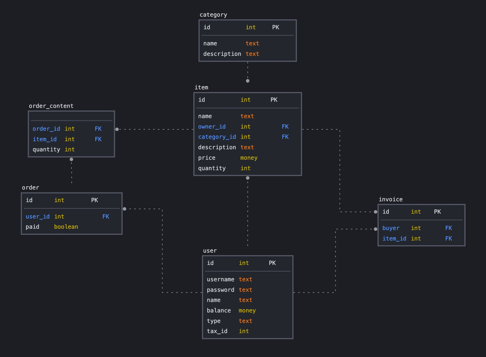

# Postgres

## Docker config info
The DB is run by docker compose as in a separate container. 
`config` folder contains an `init.sql` script that is executed by docker once when postgres is not yet initialized (i.e. container is launched for the firs time). The script contains SQL queries to create tables and their constraints. So that's something you won't need to worry about. 

DB data directory is mounted to `services/postgres/data` directory using docker volume (meaning that db data is actually stored on your machine instead of inside the container). So data is not lost after the container restart. If you ever need to reinitialize postgres, you'll need to delete this directory and run compose command again. This way the `init.sql` script will be executed again. 
*`/data` directory is added to .gitignore, so everyone can have their own local data without worrying about pushing it to git.*<bt>

For debugging purposes you may need to populate the db with your own data. 
At some point docker network will be configured is such a way that all of the services except the Primary entrypoint will be unavailable. Until then, you may connect directly to database using any db client of choice. One such client is DBeaver (https://dbeaver.io/). 
If you're running it on your own machine the host will obviously be `localhost`. As for the port, database name, user and password - check out `docker-compose.yml` and `.env` files, everything is passed to the containers as environment variables.
If you want to access the Postgres console using the running image in the conter should: 
- get to the local server - `docker exec -it <container_id> bash`
- start console - `psql -d <database_name> -U <database_user_name>`

## DB Diagram
*This might be a subject for change*

